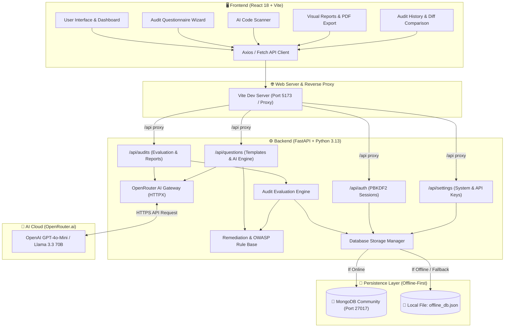
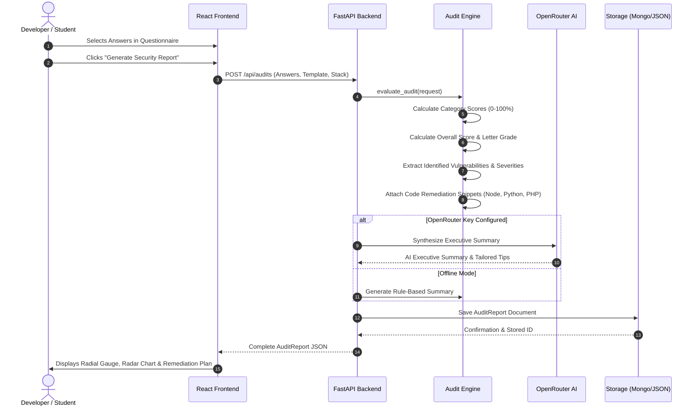
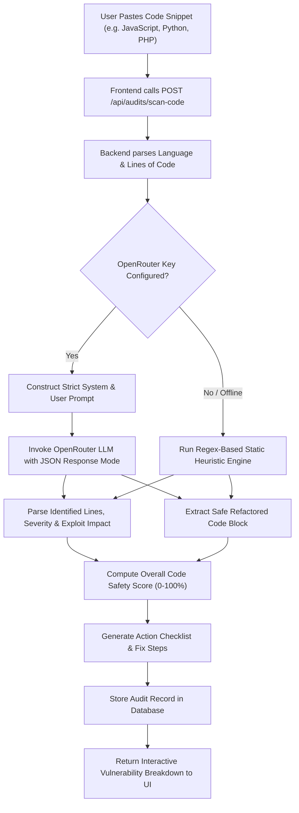
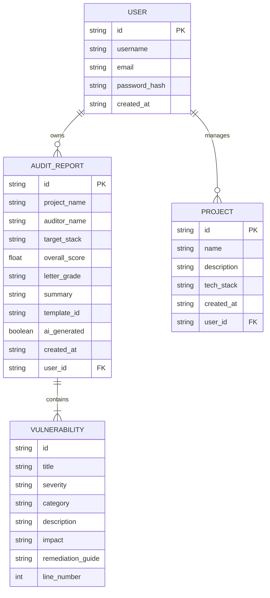

# 📐 SecureCheck – System Architecture & Technical Documentation

This document provides a visual and in-depth technical overview of how SecureCheck evaluates security, processes AI requests, scores vulnerabilities, and persists data across offline and online environments.

---

## 1. High-Level System Architecture

The diagram below illustrates the end-to-end communication flow between the React Single-Page Application (SPA), the FastAPI asynchronous backend, the OpenRouter LLM AI integration, and the dual-layer database engine:

---

## 2. Audit Execution & Scoring Lifecycle

When a developer submits an audit questionnaire or asks AI to generate a report, the request follows a strict evaluation pipeline:

---

## 3. AI Code Snippet Scanner Pipeline

The Code Snippet Scanner (`/code-scanner`) accepts raw source code and conducts static security flaw detection:

---

## 4. Mathematical Scoring Model

The security score is calculated deterministically using weighted category averages:

$$\text{Overall Score} = \sum_{c=1}^{N} \left( \frac{\text{Category Score}_c}{N} \right)$$

Where each **Category Score** is determined by the selected answer options in that category:

$$\text{Category Score}_c = \left( \frac{\sum_{i=1}^{M_c} w_i}{M_c} \right) \times 100$$

- $w_i \in [0.0, 1.0]$ is the normalized weight of the chosen option for question $i$.
- $M_c$ is the total number of questions answered within category $c$.
- $N$ is the number of active categories in the audit.

### Letter Grade Scale:

| Score Range | Letter Grade | Compliance Level | Color Token |
| :--- | :---: | :--- | :--- |
| **85% – 100%** | **Grade A** | Production Ready / Highly Secure | `#10b981` (Emerald Green) |
| **70% – 84%** | **Grade B** | Good Foundation / Minor Hardening Needed | `#38bdf8` (Cyan Blue) |
| **50% – 69%** | **Grade C** | Moderate Risk / Needs Immediate Fixes | `#f59e0b` (Amber Orange) |
| **0% – 49%** | **Grade F / D** | Critical Vulnerabilities Detected | `#f43f5e` (Rose Red) |

---

## 5. Database Schema & Data Models

SecureCheck utilizes Pydantic v2 schemas that map seamlessly to both MongoDB BSON documents and offline JSON stores:

---

## 6. REST API Endpoint Reference

| Method | Endpoint | Description | Request Body / Params |
| :--- | :--- | :--- | :--- |
| `GET` | `/api/settings/status` | System health, database connection mode, and AI key status. | None |
| `POST` | `/api/settings` | Update OpenRouter API key or active AI model. | `UpdateSettingsRequest` |
| `POST` | `/api/auth/register` | Register a student developer user account. | `{ username, email, password }` |
| `POST` | `/api/auth/login` | Authenticate user and receive session token. | `{ email, password }` |
| `GET` | `/api/questions/templates` | Retrieve all pre-configured audit templates. | None |
| `GET` | `/api/questions/template/{id}` | Fetch questions and options for a specific template. | `template_id` path param |
| `POST` | `/api/questions/generate-ai` | Generate dynamic security checklist using AI. | `{ tech_stack, project_name, focus_areas }` |
| `POST` | `/api/audits` | Evaluate questionnaire responses and create an audit. | `AuditRequest` |
| `POST` | `/api/audits/scan-code` | Scan a source code snippet for security flaws. | `CodeScanRequest` |
| `GET` | `/api/audits` | Query saved audits with optional filtering & sorting. | `?user_id=&search=&sort_by=` |
| `GET` | `/api/audits/{id}` | Retrieve full audit report details by ID. | `audit_id` path param |
| `DELETE`| `/api/audits/{id}` | Delete an audit report. | `audit_id` path param |
| `POST` | `/api/audits/compare` | Calculate side-by-side diff between two audits. | `{ audit_id_1, audit_id_2 }` |
| `GET` | `/api/audits/{id}/export/markdown` | Download formatted Markdown report. | `audit_id` path param |
